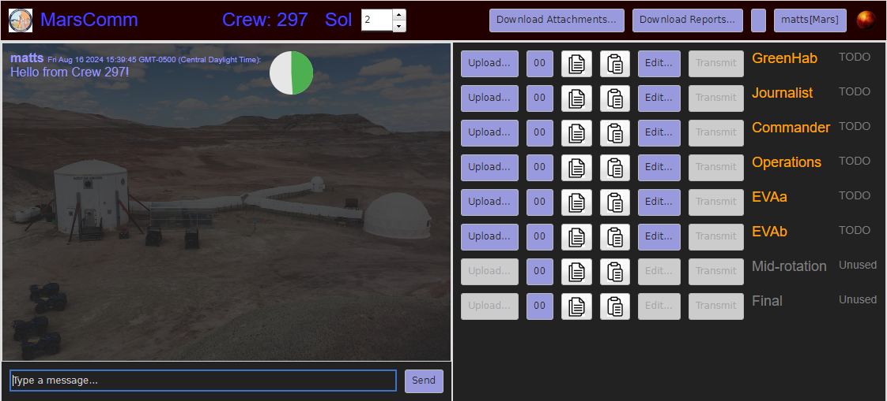

# MarsComm Client



The MarsComm client is a single-page JavaScript application that uses the Qooxdoo framework (v7.7).
It is only designed to work with the MarsComm server.
To further develop this sofware, you must have at least a basic familiarity with Qooxdoo.  
See https://qooxdoo.org/ for tutorials and documentation on the Qooxdoo framework.

The Qooxdoo framework can be installed within the repo using: 

```bash
npm install
```

Then start the Qooxdoo compiler by running:

```bash
npx qx serve
```

AFter the compiler is running, any changes to the source code, for example the main file
at `source/class/myapp/Application.js` will be noticed by the compiler and automatically recompiled.
The compiler will automatically serve the resulting app on http://localhost:8082, but you can 
change the port in `compile.json`